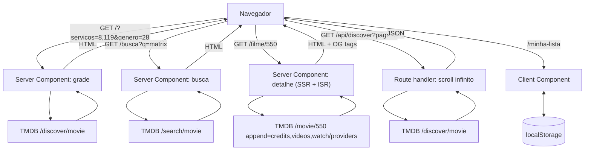

# ondeassisto.com.br — Design do catálogo de filmes em streaming

| | |
|---|---|
| **Data** | 2026-08-16 |
| **Autor** | Mauricio J. Gomes |
| **Status** | Design aprovado — aguardando plano de implementação |
| **Domínio** | ondeassisto.com.br (registrado em CPF) |
| **Natureza** | Projeto pessoal, sem monetização |
| **Referência técnica** | [`docs/tmdb-api-ficha-tecnica.md`](../../tmdb-api-ficha-tecnica.md) — fatos da API verificados em fonte primária |

---

## 1. Objetivo

Um site público que responde a uma pergunta: **quais filmes estão disponíveis agora nos serviços de streaming que eu assino, no Brasil.**

O usuário marca os serviços que assina, refina por gênero, ano e nota, e navega uma grade de pôsteres. Ao clicar num filme, chega a uma página com sinopse, elenco, trailer e onde assistir. Pode salvar filmes numa lista pessoal que vive no próprio navegador.

Fonte de dados: **API do TMDB**, `watch_region=BR`, metadados em `pt-BR`. Os dados de disponibilidade do TMDB são originados da **JustWatch**.

---

## 2. Escopo do v1

### Dentro

- Grade de filmes filtrada por provedor, gênero, ano, nota e ordenação — com estado na URL
- Busca por título, permanente no cabeçalho — com semântica própria, ver §3.7
- Página de detalhe por filme, com URL própria, renderizada no servidor
- Watchlist pessoal em `localStorage`, sem login
- Tema escuro ("cinema"), responsivo
- Atribuição TMDB e JustWatch conforme exigido

### Fora — decidido explicitamente

| Fora do v1 | Motivo |
|---|---|
| Séries de TV | Dobra os endpoints (`/discover/tv` tem `sort_by` diferente) e a navegação. Cabe em v2 |
| Login e conta de usuário | Watchlist local resolve o caso de uso sem tornar-se controlador de dado pessoal |
| Sincronização da watchlist entre dispositivos | Consequência da decisão acima. Caminho futuro: conta TMDB nativa, sem banco próprio |
| "Novidades / chegou esta semana" | **Impossível com o TMDB** — ver §11.1 |
| Selo de provedor em cada pôster da grade | Custo de API desproporcional. Ver §3.5 |
| Qualquer recurso de IA/LLM | **Proibido pelo ToS do TMDB.** Ver §10.4 |
| Monetização (anúncio, afiliado, tier pago) | Quebra chave developer do TMDB e Vercel Hobby simultaneamente |

---

## 3. Decisões de produto

### 3.1 Catálogo atual, não trilha de novidades

O app mostra o que **está** disponível hoje. Não mostra o que *entrou* recentemente, porque essa informação não existe na API (§11.1).

### 3.2 O filtro mora na URL

`/?servicos=8,119&genero=28&ordem=popularidade` é uma página real, renderizada no servidor, compartilhável e indexável. Não existe estado de filtro no React.

**Consequência:** cada combinação de filtros é uma página distinta para o Google. É o que sustenta a escolha de página de detalhe com URL própria (§4.2).

### 3.3 Só assinatura na grade

Default: `with_watch_monetization_types=flatrate`. "Disponível no meu streaming" significa **incluído na assinatura**.

- Toggle opcional soma `free|ads` (Pluto TV, Vix e similares)
- **Aluguel e compra não aparecem na grade.** Aparecem apenas na página do filme, em bloco visualmente separado, rotulado como transacional

### 3.4 Ordenação por nota exige piso de votos

O TMDB não aplica correção bayesiana a `vote_average` no `/discover`. Ordenar por nota sem piso enche o topo de títulos obscuros com 1–3 votos.

**Regra:** `vote_count.gte=200` acompanha **toda requisição em que `vote_average` participe** — seja como ordenação (`sort_by=vote_average.desc`), seja como filtro (`vote_average.gte`).

O piso está amarrado ao **dado**, não à ordenação. Filtrar "nota mínima 7" sem piso de votos admitiria um filme com um único voto 10 exatamente como o topo da lista admitia — o efeito é menos visível (com `popularity.desc` esses títulos não sobem ao topo), mas polui a cauda e infla a contagem de resultados. O piso não é configurável pelo usuário no v1.

### 3.5 Sem selo de provedor na grade

`/discover/movie` filtra por provedor mas **não devolve** qual provedor (§11.2). Pintar o selo em cada pôster custaria uma chamada extra por filme — 20 por página.

**Decisão:** a grade não mostra selo. O filtro já garante que todo resultado está num serviço marcado. O selo aparece na página do filme.

**Caminho de evolução registrado (não implementar no v1):** disparar *uma consulta `/discover` por serviço marcado* em paralelo, em vez de uma consulta com `8|119`. Cada resultado passa a saber sua origem, e o selo sai sem chamada extra — 3 serviços marcados = 3 chamadas, não 21. O custo é mesclagem e paginação estável no servidor. Só vale se o uso real mostrar que a ambiguidade incomoda.

### 3.6 Watchlist local, com snapshot

`localStorage`, schema versionado. Guarda um **snapshot mínimo** do filme (id, título, `poster_path`, ano), não apenas o id — assim `/minha-lista` renderiza sem disparar uma chamada por item salvo.

### 3.7 A busca é um caminho separado do catálogo

A grade e a busca respondem a perguntas diferentes e **não compartilham semântica**.

- A **grade** responde "o que tem nos meus serviços" — e por isso é construída sobre `/discover/movie`, o único endpoint que aceita filtro por provedor
- A **busca** responde "esse filme, onde está" — e cobre o catálogo **inteiro**, não apenas os serviços marcados

**Decisão, em três partes:**

1. **A busca não filtra por serviço.** Esconder um resultado porque ele não está na sua assinatura seria o pior comportamento possível — quem digita o nome de um filme quer saber onde ele está, inclusive quando a resposta é "em nenhum lugar seu"
2. **A busca anota a disponibilidade.** Cada resultado exibido recebe o selo dos serviços onde está, buscado por `/movie/{id}/watch/providers`
3. **Resultados nos serviços marcados aparecem primeiro**, com o selo destacado; os demais vêm abaixo, sob um separador que diz explicitamente que não estão na sua assinatura

**Por que aqui o N+1 é aceitável, e na grade não.** Os perfis de custo são diferentes o bastante para justificar decisões opostas:

| | Grade (§3.5) | Busca |
|---|---|---|
| Itens por carga | 20, com scroll infinito | os da primeira página, **limitado a 10** |
| Frequência | toda navegação e troca de filtro | ação deliberada do usuário |
| Intenção | passeio | alta — a pessoa quer **este** filme |
| Custo por interação | 20 chamadas, repetidas indefinidamente | até 10 chamadas, uma vez, disparadas em paralelo |

Com TTL de 6 h em `/movie/{id}/watch/providers` (§4.3), buscas repetidas do mesmo título saem do cache. O teto do TMDB é de aproximadamente 40 requisições por segundo (§8) — dez chamadas paralelas por busca cabem com folga numa escala pessoal.

**Limite explícito:** apenas os primeiros 10 resultados são anotados. Do 11º em diante o selo não aparece, e a UI diz isso — o usuário refina o termo. Silenciosamente não anotar seria pior do que admitir o corte.

> **Verificado em 16/08/2026 (§9.3 item 5):** `/3/search/movie` **ignora silenciosamente** `watch_region` e `with_watch_providers` — 92 resultados para "matrix" com e sem os parâmetros, HTTP 200 nos dois casos. A premissa desta seção está confirmada: filtrar a busca por provedor é impossível numa chamada. `year` funciona (92 → 5 com `year=1999`) e pode entrar como refinamento futuro.

---

## 4. Arquitetura

Uma aplicação **Next.js (App Router)** hospedada na **Vercel**. Sem banco de dados, sem autenticação, sem serviço separado.

**Invariante central:** o token do TMDB nunca sai do servidor. Nenhuma variável de ambiente com prefixo `NEXT_PUBLIC_` toca credencial.



### 4.1 Rotas

| Rota | Renderização | Observações |
|---|---|---|
| `/` | Server Component | Grade. Lê `searchParams`, chama TMDB, devolve HTML. `loading.tsx` com skeleton |
| `/busca` | Server Component | Busca por título (§3.7). Lê `q`; não filtra por serviço, mas anota disponibilidade nos 10 primeiros e ordena os marcados à frente. `loading.tsx` com skeleton |
| `/filme/[id]` | Server Component + ISR | `generateMetadata` produz OG tags para preview e indexação. `loading.tsx` com skeleton |
| `/minha-lista` | Client Component | Lê `localStorage`. Não toca no servidor |
| `/sobre` | Estática | Atribuição TMDB e JustWatch, aviso legal |
| `/api/discover` | Route handler | Existe apenas para o scroll infinito (páginas 2+) |

A grade fica sob `Suspense` chaveado por `searchParams`, para que o skeleton reapareça a cada troca de filtro — sem isso, clicar num chip deixa a tela congelada até a navegação de servidor concluir.

### 4.2 Por que página em vez de modal

A página de detalhe tem URL própria porque:

- É compartilhável com preview no WhatsApp (OG tags)
- É indexável — busca orgânica é o canal natural de um catálogo de filmes
- É onde a watchlist e o "onde assistir" têm lugar natural

Modal seria mais barato, mas não tem URL, logo não existe para o buscador.

### 4.3 Cache

| Recurso | TTL | Justificativa |
|---|---|---|
| `/configuration` | 24 h | Valores efetivamente estáticos |
| `/watch/providers/movie?watch_region=BR` | 24 h | Lista de provedores muda raramente |
| `/discover/movie` | 1 h | Equilíbrio entre frescor e volume de chamadas |
| `/search/movie` | 1 h | Mesmo perfil de volatilidade da grade |
| `/movie/{id}` (com append) | 6 h | Metadados aceitariam 24 h, mas a resposta carrega disponibilidade junto — o dado mais volátil manda no TTL |
| `/movie/{id}/watch/providers` | 6 h | Chamada isolada, usada só pela anotação da busca (§3.7) |

Implementado via `revalidate` do Next (Vercel Data Cache).

**Teto contratual:** o ToS do TMDB (§1.C) proíbe cachear qualquer informação por mais de 6 meses. Os TTLs acima estão duas ordens de grandeza abaixo disso — sem risco, mas o limite fica registrado para que nenhuma otimização futura o ultrapasse.

---

## 5. Módulos

**Regra de fronteira:** nada acima de `lib/tmdb/` conhece o formato de resposta do TMDB; nada abaixo de `components/` conhece React.

### 5.1 `lib/tmdb/` — único ponto de contato com a API

| Arquivo | Responsabilidade | Depende de |
|---|---|---|
| `client.ts` | `fetchTmdb(path, params, opts)`. Header `Authorization: Bearer`, `language=pt-BR`, timeout, backoff no 429, erros tipados por `status_code` | — |
| `discover.ts` | `discoverMovies(filtros, page)` → resultados normalizados + `totalPages` limitado a 500 | `client` |
| `movie.ts` | `getMovie(id)` — **chamada única** com `append_to_response=credits,videos,watch/providers`: metadados, elenco, trailer e ofertas do bucket `BR`; `getMovieProviders(id)` → ofertas isoladas, usado pela anotação da busca | `client` |
| `search.ts` | `searchMovies(termo, page)` → resultados normalizados, **anotados com disponibilidade** para os 10 primeiros via `getMovieProviders` em paralelo, e particionados em "nos seus serviços" / "fora" (§3.7) | `client`, `movie` |
| `providers.ts` | `getBrProviders()` → lista viva ordenada por `display_priorities.BR` **ascendente — menor valor = posição mais alta** | `client` |
| `images.ts` | `posterUrl(path, size)`, `backdropUrl(path, size)`, `logoUrl(path, size)` a partir de `secure_base_url` | `client` |
| `types.ts` | Tipos do domínio (`Filme`, `Oferta`, `Provedor`) — não tipos crus da API | — |

**Sobre o `append_to_response` em `getMovie` — verificado em 16/08/2026 contra a API ao vivo (§9.3):** `credits`, `videos` e `watch/providers` são todos aceitos, e o bucket `BR` vindo pelo append é **byte-idêntico** ao do endpoint direto. A página de detalhe é portanto **uma única chamada HTTP**, não duas.

Duas consequências:

- **O TTL da chamada combinada é 6 h**, não 24 h (§4.3). Metadados aceitariam 24 h, mas disponibilidade não — e ao juntar tudo numa resposta, o mais volátil manda. Ainda assim é menos tráfego que duas chamadas separadas
- **Trailer exige atenção ao idioma.** Com `language=pt-BR`, o teste devolveu 1 trailer; sem o parâmetro, 3. Usar `include_video_language=pt,en,null` para não perder o trailer quando não houver versão em português

**Autenticação:** header `Authorization: Bearer <TMDB_READ_TOKEN>`. É o método documentado como padrão pelo TMDB e o único presente no OpenAPI oficial. Não usar o parâmetro `api_key` na query string — funciona igual, mas vaza em log de proxy, CDN e `Referer`.

### 5.2 `lib/filters/` — tradutor URL ↔ TMDB

Puro, sem I/O. É a camada de maior risco de regressão silenciosa e a mais fácil de testar.

- `parseSearchParams(searchParams)` → `Filtros`, validado, com defaults
- `toSearchParams(filtros)` → query string

**Regras que vivem aqui:**

- Provedores usam **pipe (`|`) = OR**. Vírgula significaria "está na Netflix **e** no Prime ao mesmo tempo", que casa com quase nada
- `watch_region=BR` é sempre incluído. **Enviar `with_watch_providers` sem `watch_region` devolve resultados não filtrados, silenciosamente, com HTTP 200.** Medido em 16/08/2026: **1.169.919 resultados sem a região contra 4.891 com ela**. É o modo de falha mais perigoso da API, porque não falha — entrega o catálogo global parecendo sucesso
- `page` é limitado a 500 antes de qualquer chamada
- **Valor inválido é descartado e cai no default**, nunca gera erro. Vale para todos os parâmetros: `ordem` desconhecida vira `popularidade`, `ano` fora de faixa é ignorado, `servicos` com id não numérico é descartado. Uma URL vinda de link antigo ou adulterada renderiza a grade, não uma tela de erro
- **Home sem `servicos`**: nenhum filtro de provedor é aplicado — a grade mostra o catálogo geral do TMDB para o Brasil. Ausência de parâmetro significa "sem filtro", como em todos os demais campos

### 5.3 `lib/watchlist/` — exclusivamente cliente

```
{ v: 1, items: [ { id, title, posterPath, year, addedAt } ] }
```

- `v` versiona o schema para que migração futura não quebre listas existentes
- Degrada sem quebrar quando `localStorage` está indisponível (aba anônima, cota estourada): passa a memória de sessão e avisa o usuário

### 5.4 `components/`

`FilterBar` (escreve na URL, sem estado próprio) · `SearchBar` (cabeçalho permanente, navega para `/busca`) · `MovieGrid` · `MovieCard` · `InfiniteLoader` · `MovieDetail` · `CastList` · `TrailerEmbed` · `ProviderOffers` · `WatchlistButton` · `Attribution` · `EmptyState` · `ErrorState` · `GridSkeleton` · `DetailSkeleton`.

---

## 6. Contratos de dados

### 6.1 Filtros

| Campo | Origem na URL | Parâmetro TMDB |
|---|---|---|
| provedores | `servicos=8,119` | `with_watch_providers=8\|119` |
| região | fixa | `watch_region=BR` |
| monetização | `incluirGratis=1` | `with_watch_monetization_types=flatrate` ou `flatrate\|free\|ads` |
| gênero | `genero=28` | `with_genres=28` |
| ano | `ano=2024` | `primary_release_year=2024` |
| nota mínima | `nota=7` | `vote_average.gte=7` **+ `vote_count.gte=200`** |
| ordenação | `ordem=nota` | ver tabela abaixo |
| busca (rota `/busca`) | `q=matrix` | `query=matrix` — **sem** parâmetros de provedor (§3.7) |
| página | — | `page` (limitado a 500) |

Sempre presentes: `language=pt-BR`, `include_adult=false`, `include_video=false`.

**Vocabulário de `ordem` — valores aceitos, exaustivo:**

| `ordem=` | `sort_by` | Acompanhamento obrigatório |
|---|---|---|
| `popularidade` **(default)** | `popularity.desc` | — |
| `nota` | `vote_average.desc` | `vote_count.gte=200` |
| `recentes` | `primary_release_date.desc` | `primary_release_date.lte=<hoje>`, para excluir não lançados |

Qualquer outro valor é descartado e cai no default (§5.2). O vocabulário é fechado porque §3.2 torna cada combinação uma URL indexável — mudá-lo depois custa caro.

### 6.2 Ofertas de um filme

`/movie/{id}/watch/providers` devolve `results` como **objeto chaveado por país**, não array. O bucket `BR` contém:

- `link` — URL da página `/watch` do próprio TMDB (não é deep link do provedor)
- `flatrate`, `rent`, `buy`, `ads` — **presentes apenas quando há oferta daquele tipo**. Null-check obrigatório em cada chave
- **`free` existe e é comum no Brasil** — verificado em 16/08/2026: 3.052 títulos casam por `with_watch_monetization_types=free` em BR, e buckets reais trazem combinações como `{link, free, flatrate, rent}` e `{link, ads, free}`. O exemplo da documentação (Fight Club) simplesmente não tinha oferta gratuita; a ausência ali não era regra. Ler `free` como chave de primeira classe, ao lado de `flatrate` e `ads`
- Cada provedor traz 4 campos: `provider_id`, `provider_name`, `logo_path`, `display_priority`

### 6.3 Provedores

Obtidos de `/watch/providers/movie?watch_region=BR`. **Nunca fixados em código.**

Dois motivos concretos:

**Lista real do Brasil, verificada em 16/08/2026** — exatamente **85 provedores**, ordenados por `display_priorities.BR`:

| Prioridade | ID | Provedor |
|---|---|---|
| 0 | `8` | Netflix |
| 1 | `119` | Amazon Prime Video |
| 2 | `350` | Apple TV |
| 3 | `337` | Disney Plus |
| 5 | `167` | Claro video |
| 6 | `47` | Looke |
| 7 | `531` | Paramount Plus |
| 8 | `1899` | **HBO Max** |
| 9 | `2` | Apple TV Store |
| 10 | `307` | Globoplay |
| 11 | `283` | Crunchyroll |
| 12 | `11` | MUBI |

O que a verificação corrigiu em relação à documentação:

- **HBO Max é `1899`.** O `384` da documentação **não existe** na lista brasileira. Fixá-lo no código produziria uma prateleira vazia
- **Prime Video é `119` apenas.** O `9` citado na ficha **não aparece** em BR
- **A nomenclatura da Apple inverteu:** hoje `350` é "Apple TV" (assinatura) e `2` é "Apple TV Store" (transacional). A ficha registrava o oposto. Um chip de assinatura montado sobre `2` traria catálogo de aluguel
- **Existem variantes "with Ads" com ID próprio:** `1796` = Netflix Standard with Ads, `2100` = Amazon Prime Video with Ads. São a mesma marca comercial com outro `provider_id`
- **Telecine só existe como revenda:** `2156` = "Telecine Amazon Channel". Não há Telecine autônomo

**Regra:** o casamento marca↔provedor é feito por **conjunto de IDs**, nunca por ID único.

O Brasil tem aproximadamente 85 provedores de filmes, com cauda longa dominada por revendas ("Telecine Amazon Channel", "Paramount+ Amazon Channel"). A UI mostra os principais por `display_priorities.BR` e esconde o resto atrás de "ver todos".

### 6.4 Imagens

URL montada com três peças: `secure_base_url` + tamanho + `file_path`.

- Base: `https://image.tmdb.org/t/p/`
- Pôsteres: `w92`, `w154`, `w185`, `w342`, `w500`, `w780`, `original`
- Backdrops: `w300`, `w780`, `w1280`, `original`
- Logos: `w45`, `w92`, `w154`, `w185`, `w300`, `w500`, `original`

**Os três conjuntos são distintos e não intercambiáveis.** `w500` é tamanho válido de pôster e **não existe** em `backdrop_sizes` — usar o palpite errado devolve 404 justamente no elemento visualmente dominante da página de detalhe.

**Logos de provedor são `.jpg`** — retângulos opacos, sem transparência. O card precisa ser desenhado contando com isso, não com PNG recortado.

---

## 7. Design visual

Tema **escuro "cinema"**: fundo quase preto, acento âmbar, pôster como elemento dominante. A interface recua para que a capa apareça.

- Grade responsiva de pôsteres em proporção 2:3
- Título e ano **abaixo** da imagem, no corpo do card — nunca sobrepostos (§7.1)
- Nota em pílula âmbar opaca no canto do pôster — a única sobreposição permitida
- Chips de provedor no topo, ativos em âmbar
- Página de detalhe com backdrop no topo e pôster sobreposto

### 7.1 Acessibilidade — critérios verificáveis

Tema escuro é o padrão fácil de errar em contraste. A paleta abaixo está **medida**, não estimada — os valores são razões de contraste WCAG contra o fundo `#0b0b0f`:

| Papel | Hex | Contraste | Exigido | Situação |
|---|---|---|---|---|
| Fundo | `#0b0b0f` | — | — | referência |
| Texto primário | `#f2f2f4` | **17,6:1** | 4,5:1 | passa AAA |
| Texto secundário (ano, metadados) | `#9a9aa6` | **7,1:1** | 4,5:1 | passa AAA |
| Âmbar (acento, chip ativo, nota) | `#f5c518` | **12,1:1** | 4,5:1 | passa AAA |
| Texto escuro sobre âmbar | `#0b0b0f` sobre `#f5c518` | **12,1:1** | 4,5:1 | passa AAA |

A paleta inteira passa em AAA com folga. Isso não é sorte: âmbar saturado sobre preto é uma das poucas combinações escuras que resolve contraste e identidade ao mesmo tempo. **Qualquer alteração desses hexadecimais exige medir de novo** — escurecer o âmbar para "suavizar" é a forma mais provável de quebrar a conformidade sem perceber.

**Decisão estrutural: o texto não fica sobre o pôster.** Título e ano vão **abaixo** da imagem, no corpo do card. Contraste sobre capa arbitrária é indeterminado por definição — nenhuma medição vale, porque a imagem muda a cada filme. A única sobreposição permitida é a pílula de nota, que tem fundo âmbar **sólido e opaco** (nunca gradiente, nunca translucidez).

Demais critérios, todos verificáveis:

1. **`alt` do pôster = título do filme.** O placeholder de `poster_path` null tem `alt` próprio descrevendo a ausência, não `alt=""`
2. **Chips de provedor são `<button>`** com `aria-pressed`, não `<div>` colorido — o estado ativo precisa existir para leitor de tela, não só para o olho
3. **Anel de foco visível** em âmbar, 2 px com deslocamento, em todo elemento focável. Nunca `outline: none` sem substituto
4. **Alvo de toque mínimo de 44 px** nos chips em tela pequena — é onde a barra de filtros é mais densa
5. **`prefers-reduced-motion` respeitado** no shimmer do skeleton e em qualquer transição
6. **Navegação por teclado completa**: cards são links, a grade é percorrível na ordem visual, e o modal não existe (§4.2), o que elimina a classe inteira de problemas de armadilha de foco

O tema é **exclusivamente escuro** — não há alternância clara, e `prefers-color-scheme` não é consultado. É escolha deliberada de produto, não omissão.

---

## 8. Tratamento de erros

| Situação | Comportamento |
|---|---|
| `429` (status_code 25) | Backoff exponencial com jitter, máximo 3 tentativas. **Não há header `Retry-After` documentado** — ler se vier, nunca depender |
| `503` (status_code 46 ou 9) | Página de indisponibilidade. Sem retry agressivo — é manutenção do TMDB |
| `page > 500` (status_code 22) | Limitado antes da chamada. A API nunca deve ter a chance de recusar |
| Filme inexistente | `notFound()`, HTTP 404 real, para não indexar página de erro |
| `poster_path: null` | Placeholder. Comum em títulos de cauda longa |
| Sem bucket `BR` em watch/providers | "Sem disponibilidade em streaming no Brasil" — é informação, não falha |
| Chave de monetização ausente | Null-check. A API só inclui a chave quando há oferta |
| `localStorage` indisponível | Watchlist degrada para memória de sessão, com aviso |
| Falha no detalhe | É **uma** chamada com append (§5.1) — ou vem tudo, ou não vem nada. Não existe estado parcial entre metadados e ofertas. Falha total cai no tratamento de erro da rota |
| Sub-recurso vazio no detalhe | O append pode devolver `credits` sem elenco ou `videos` sem trailer. Cada bloco da página some individualmente, sem derrubar os demais |
| Falha na anotação da busca | As até 10 chamadas de disponibilidade são independentes. A que falhar deixa aquele resultado sem selo — nunca derruba a lista nem bloqueia a renderização dos demais. Sem selo, o item cai no grupo "fora dos seus serviços" e o card diz "disponibilidade não verificada", em vez de afirmar ausência |
| Resultado vazio | Estado vazio explícito, com sugestão de afrouxar filtros |
| Requisição em andamento | Skeleton na proporção 2:3, via `loading.tsx` + `Suspense`. O chip clicado fica em estado pendente até a navegação concluir — com backoff de até 3 tentativas no 429, isso pode levar segundos, e a tela não pode ficar congelada sem sinal |

**Limite de taxa:** o teto do TMDB é *soft*, na faixa de 40 requisições por segundo, e pode mudar sem aviso. Não há cota diária. O app respeita o 429 e não tenta contorná-lo.

---

## 9. Testes

### 9.1 Unitários

- `lib/filters` — serialização pipe vs vírgula, defaults, entrada hostil na URL, limite de 500
- `lib/filters` — vocabulário fechado de `ordem`: cada valor mapeia para o `sort_by` correto e arrasta seu acompanhamento obrigatório; valor desconhecido cai no default sem erro
- Piso de votos aplicado nos **dois** casos em que `vote_average` participa: ordenação e filtro de nota mínima
- `lib/tmdb/images` — montagem das três peças, nas três famílias de tamanho (pôster, backdrop, logo), incluindo a rejeição de `w500` como backdrop
- `lib/watchlist` — migração de schema, cota estourada, `localStorage` ausente, JSON corrompido, `v` desconhecido
- Casamento de provedor por conjunto de IDs
- `lib/tmdb/search` — particionamento em "nos seus serviços" / "fora", corte da anotação no 10º resultado, e resultado sem selo caindo no grupo correto quando a chamada de disponibilidade falha

### 9.2 Integração

Rotas com TMDB mockado por **fixtures capturadas de resposta real**, não inventadas.

### 9.3 Teste de contrato — roda sob demanda, fora do CI, com chave real

**Executado em 16/08/2026 contra a API ao vivo. Os sete itens estão resolvidos** — nenhuma suposição permanece no caminho crítico.

| # | Pergunta | Resultado |
|---|---|---|
| 1 | 20 resultados por página? | **Sim.** Netflix BR = 4.891 títulos em 245 páginas, dentro do teto de 500 |
| 2 | `provider_id` vivo do HBO Max em BR | **`1899`.** `384` não existe em BR. Lista completa e correções em §6.3 |
| 3 | `append_to_response=watch/providers` funciona? | **Sim**, e o bucket `BR` é idêntico ao do endpoint direto. Detalhe vira uma chamada |
| 4 | `credits` e `videos` no append? | **Sim.** 76 pessoas no elenco de teste. Trailer exige `include_video_language` (§5.1) |
| 5 | `/search/movie` aceita filtro por provedor? | **Não.** `watch_region` e `with_watch_providers` são **ignorados silenciosamente** — 92 resultados com e sem. `year` funciona. Confirma a premissa de §3.7 |
| 6 | A chave `free` aparece no bucket BR? | **Sim**, e é comum: 3.052 títulos em BR. Ver §6.2 |
| 7 | Vírgula é `AND`? | **Sim.** Netflix 4.891, Prime 4.359, `8\|119` = 9.130 (união), `8,119` = 124 (interseção). Ambos funcionam como documentado |

**Achado extra, o mais perigoso de todos:** `with_watch_providers=8` **sem** `watch_region` devolve HTTP 200 com **1.169.919 resultados** — o catálogo global inteiro, filtro silenciosamente descartado. Contra 4.891 com `watch_region=BR`. É o modo de falha que a §5.2 previne, agora medido: errar isso não gera erro, gera um site que parece funcionar e mostra o catálogo errado.

**Este teste vira suíte permanente**, executada sob demanda contra a API real. Os valores acima não são constantes — o catálogo muda, provedores entram e saem. O que a suíte protege são as **invariantes**: `watch_region` obrigatório, pipe é união, vírgula é interseção, o append traz as três coisas, e a busca ignora filtro de provedor.

### 9.4 E2E (Playwright)

Filtrar → grade → abrir detalhe → salvar na lista → recarregar → lista persiste.

---

## 10. Conformidade

### 10.1 Atribuição TMDB — obrigatória por contrato

- **Logo TMDB** de um dos arquivos SVG aprovados, sem modificação de cor, proporção, rotação ou espelhamento, e **menos proeminente** que a marca do próprio site
- **Aviso**, na redação do §3 do ToS: *"This website uses TMDB and the TMDB APIs but is not endorsed, certified, or otherwise approved by TMDB."*
- Link de volta para `https://www.themoviedb.org`
- Cores aprovadas da marca: `#0d253f`, `#01b4e4`, `#90cea1`

### 10.2 Atribuição JustWatch

Exigência literal da documentação: *"In order to use this data you must attribute the source of the data as JustWatch. If we find any usage not complying with these terms we will revoke access to the API."*

**Implementação:** referência ou logo JustWatch **em cada item onde a disponibilidade é exibida**, não apenas no rodapé. Isso segue orientação de staff do TMDB, mais exigente que o texto da documentação — na dúvida, seguir a mais exigente.

### 10.3 Links de disponibilidade

Usar o campo `link` do bucket do país, que aponta para a página `/watch` do TMDB. **Não construir deep link de provedor** — o TMDB não os fornece e orienta explicitamente a direcionar para suas próprias páginas.

### 10.4 Proibição de IA

ToS §1.C proíbe: *"Use the TMDB APIs or TMDB Content in connection with, including for training, a machine learning (ML) or artificial intelligence (AI) based Application."*

A cláusula é ampla — cobre não só treinamento, mas uso em conexão com aplicação baseada em IA, incluindo consumo em tempo de inferência. **Nenhum recurso de recomendação por LLM, RAG sobre sinopses ou chatbot entra neste produto.**

### 10.5 Aviso ao usuário

Por se tratar de site voltado ao consumidor brasileiro (CDC), exibir que a disponibilidade é **informativa**, originada da JustWatch via TMDB, e pode estar desatualizada. O TMDB não oferece SLA nem garantia de exatidão.

### 10.6 Risco conhecido e aceito — §2.A do ToS

O ToS lista como exemplo de uso comercial: *"Using TMDB, the TMDB APIs, or TMDB Content on or in connection with a 'destination' website, search engine, or interactive query-response system…"*. A primeira metade dessa frase **não traz qualificador de receita**.

Um site cuja finalidade inteira é disponibilidade em streaming é discutivelmente um *destination website* construído sobre conteúdo do TMDB — mesmo sem receita.

**Posição adotada:** risco conhecido e aceito.

Fundamento: o teste declarado pelo TMDB para uso comercial é receita — *"Your project is considered commercial if the primary purpose is to create revenue for the benefit of the owner."* Este projeto é pessoal, com domínio registrado em CPF, sem anúncio, afiliado ou tier pago. A chave developer é o encaixe documentado. Com receita zero, o pior cenário realista é uma solicitação de interrupção, não exposição financeira.

**Gatilho de revisão:** qualquer monetização, ou tráfego relevante. Nesse momento, consultar `sales@themoviedb.org` descrevendo o app e arquivar a resposta antes de prosseguir.

---

## 11. Limites conhecidos da API

### 11.1 Não existe "chegou agora no streaming"

**Não há, em nenhum ponto da API do TMDB, campo indicando quando um título entrou num provedor.** Sem `date_added`, sem início ou fim de disponibilidade, sem timestamp. Não há filtro nem `sort_by` correspondente — todas as opções de data em `sort_by` referem-se ao lançamento do filme, nunca à entrada no streaming.

Implementar "novidades" exigiria snapshot próprio agendado e diff entre execuções — backend, banco e job periódico. Fora do escopo por decisão explícita.

### 11.2 `/discover` não devolve o provedor

Os campos retornados são: `adult`, `backdrop_path`, `genre_ids`, `id`, `original_language`, `original_title`, `overview`, `popularity`, `poster_path`, `release_date`, `title`, `video`, `vote_average`, `vote_count`.

`with_watch_providers` é filtro de **entrada** apenas — a disponibilidade nunca é ecoada na resposta. É a origem da decisão §3.5.

### 11.3 Teto de 500 páginas

`page=501` retorna HTTP 400, status_code 22: *"Invalid page: Pages start at 1 and max at 500."* O teto efetivo é de aproximadamente **10.000 resultados por consulta**.

`total_pages` na resposta reporta valores muito acima de 500, inalcançáveis — **não usar `total_pages` cru para construir paginação.**

O catálogo de um provedor individual no Brasil cabe nesse limite. "Todos os filmes de todos os serviços" não cabe. O scroll infinito informa o fim de forma explícita, em vez de simular que acabou. Contorno conhecido, para v2: fatiar a consulta por janelas de data com `primary_release_date.gte/lte`.

### 11.4 O filtro por provedor só existe no `/discover`

Os três parâmetros de disponibilidade — `with_watch_providers`, `watch_region`, `with_watch_monetization_types` — pertencem ao `/discover`. Não há lookup reverso nos endpoints de watch provider: **`/discover/movie` é o único caminho prático para enumerar o catálogo de um provedor numa região.**

É a razão estrutural de §3.7: a busca por título não tem como respeitar o filtro de serviços numa única chamada. A disponibilidade dos resultados de busca só existe por anotação item a item — que ali é aceitável, porque o conjunto é limitado a 10 e a ação é deliberada, ao contrário da grade com scroll infinito (§3.5).

---

## 12. Configuração e implantação

### 12.1 Variáveis de ambiente

| Variável | Onde | Observação |
|---|---|---|
| `TMDB_READ_TOKEN` | `.env.local` e painel da Vercel | **Nunca** com prefixo `NEXT_PUBLIC_`. Valor não consta deste documento |

`.env*.local` no `.gitignore` desde o primeiro commit.

### 12.2 Implantação

Integração Vercel ↔ GitHub: cada push implanta. **Não é necessário criar token de acesso da Vercel** — nenhum pipeline próprio existe no v1. Se um dia houver GitHub Actions, o token deve ser *project-scoped*, com expiração, guardado em GitHub Secrets.

Domínio `ondeassisto.com.br` apontado nas configurações do projeto. Plano Hobby, coerente com a natureza não comercial.

### 12.3 Higiene do repositório

`.superpowers/` no `.gitignore` — o diretório contém os mockups da sessão de design.

---

## 13. Pendências

| # | Item | Tipo | Responsável |
|---|---|---|---|
| 1 | ~~Regerar o `TMDB_READ_TOKEN`~~ — **resolvido em 16/08/2026.** Token novo autentica (HTTP 200); o anterior retorna HTTP 401 / `status_code 7` | — | concluído |
| 2 | ~~Rodar o teste de contrato (§9.3)~~ — **resolvido em 16/08/2026.** Os sete itens verificados contra a API ao vivo; resultados e correções incorporados a §5.1, §6.2, §6.3, §8 e §9.3 | — | concluído |
| 3 | Escolher a fonte tipográfica do tema escuro | `[DECIDIR]` | implementação |
| 4 | Definir o conjunto inicial de provedores destacados na UI, a partir de `display_priorities.BR` | `[ADAPTAR]` | implementação |
| 5 | ~~Verificar `/3/search/movie`~~ — **resolvido em 16/08/2026.** Ignora filtro por provedor; `year` funciona. Registrado em §3.7 e §9.3 | — | concluído |
| 6 | Decidir o agrupamento marca↔IDs: revendas ("Telecine Amazon Channel") entram no chip da marca-mãe? "Apple TV" e "Apple TV Plus" são o mesmo chip? Transacionais puros ficam fora, por coerência com §3.3? | `[DECIDIR]` | Mauricio |

---

## 14. Referências

- Ficha técnica verificada: [`docs/tmdb-api-ficha-tecnica.md`](../../tmdb-api-ficha-tecnica.md)
- [TMDB API — documentação](https://developer.themoviedb.org/docs/getting-started)
- [TMDB API Terms of Use](https://www.themoviedb.org/api-terms-of-use)
- [TMDB — logos e atribuição](https://www.themoviedb.org/about/logos-attribution)
