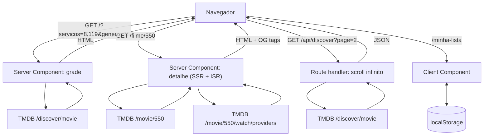

# ondeassisto.com.br — Design do catálogo de filmes em streaming

| | |
|---|---|
| **Data** | 2026-08-16 |
| **Autor** | Mauricio J. Gomes |
| **Status** | Design aprovado — aguardando plano de implementação |
| **Domínio** | ondeassisto.com.br (registrado em CPF) |
| **Natureza** | Projeto pessoal, sem monetização |
| **Referência técnica** | [`docs/tmdb-api-ficha-tecnica.md`](../../tmdb-api-ficha-tecnica.md) — fatos da API verificados em fonte primária |

---

## 1. Objetivo

Um site público que responde a uma pergunta: **quais filmes estão disponíveis agora nos serviços de streaming que eu assino, no Brasil.**

O usuário marca os serviços que assina, refina por gênero, ano e nota, e navega uma grade de pôsteres. Ao clicar num filme, chega a uma página com sinopse, elenco, trailer e onde assistir. Pode salvar filmes numa lista pessoal que vive no próprio navegador.

Fonte de dados: **API do TMDB**, `watch_region=BR`, metadados em `pt-BR`. Os dados de disponibilidade do TMDB são originados da **JustWatch**.

---

## 2. Escopo do v1

### Dentro

- Grade de filmes filtrada por provedor, gênero, ano, nota e ordenação — com estado na URL
- Busca por título, permanente no cabeçalho
- Página de detalhe por filme, com URL própria, renderizada no servidor
- Watchlist pessoal em `localStorage`, sem login
- Tema escuro ("cinema"), responsivo
- Atribuição TMDB e JustWatch conforme exigido

### Fora — decidido explicitamente

| Fora do v1 | Motivo |
|---|---|
| Séries de TV | Dobra os endpoints (`/discover/tv` tem `sort_by` diferente) e a navegação. Cabe em v2 |
| Login e conta de usuário | Watchlist local resolve o caso de uso sem tornar-se controlador de dado pessoal |
| Sincronização da watchlist entre dispositivos | Consequência da decisão acima. Caminho futuro: conta TMDB nativa, sem banco próprio |
| "Novidades / chegou esta semana" | **Impossível com o TMDB** — ver §11.1 |
| Selo de provedor em cada pôster da grade | Custo de API desproporcional. Ver §3.5 |
| Qualquer recurso de IA/LLM | **Proibido pelo ToS do TMDB.** Ver §10.4 |
| Monetização (anúncio, afiliado, tier pago) | Quebra chave developer do TMDB e Vercel Hobby simultaneamente |

---

## 3. Decisões de produto

### 3.1 Catálogo atual, não trilha de novidades

O app mostra o que **está** disponível hoje. Não mostra o que *entrou* recentemente, porque essa informação não existe na API (§11.1).

### 3.2 O filtro mora na URL

`/?servicos=8,119&genero=28&ordem=popularidade` é uma página real, renderizada no servidor, compartilhável e indexável. Não existe estado de filtro no React.

**Consequência:** cada combinação de filtros é uma página distinta para o Google. É o que sustenta a escolha de página de detalhe com URL própria (§4.2).

### 3.3 Só assinatura na grade

Default: `with_watch_monetization_types=flatrate`. "Disponível no meu streaming" significa **incluído na assinatura**.

- Toggle opcional soma `free|ads` (Pluto TV, Vix e similares)
- **Aluguel e compra não aparecem na grade.** Aparecem apenas na página do filme, em bloco visualmente separado, rotulado como transacional

### 3.4 Ordenação por nota exige piso de votos

O TMDB não aplica correção bayesiana a `vote_average` no `/discover`. Ordenar por nota sem piso enche o topo de títulos obscuros com 1–3 votos.

**Regra:** `sort_by=vote_average.desc` é sempre acompanhado de `vote_count.gte=200`. O piso não é configurável pelo usuário no v1.

### 3.5 Sem selo de provedor na grade

`/discover/movie` filtra por provedor mas **não devolve** qual provedor (§11.2). Pintar o selo em cada pôster custaria uma chamada extra por filme — 20 por página.

**Decisão:** a grade não mostra selo. O filtro já garante que todo resultado está num serviço marcado. O selo aparece na página do filme.

**Caminho de evolução registrado (não implementar no v1):** disparar *uma consulta `/discover` por serviço marcado* em paralelo, em vez de uma consulta com `8|119`. Cada resultado passa a saber sua origem, e o selo sai sem chamada extra — 3 serviços marcados = 3 chamadas, não 21. O custo é mesclagem e paginação estável no servidor. Só vale se o uso real mostrar que a ambiguidade incomoda.

### 3.6 Watchlist local, com snapshot

`localStorage`, schema versionado. Guarda um **snapshot mínimo** do filme (id, título, `poster_path`, ano), não apenas o id — assim `/minha-lista` renderiza sem disparar uma chamada por item salvo.

---

## 4. Arquitetura

Uma aplicação **Next.js (App Router)** hospedada na **Vercel**. Sem banco de dados, sem autenticação, sem serviço separado.

**Invariante central:** o token do TMDB nunca sai do servidor. Nenhuma variável de ambiente com prefixo `NEXT_PUBLIC_` toca credencial.



### 4.1 Rotas

| Rota | Renderização | Observações |
|---|---|---|
| `/` | Server Component | Grade. Lê `searchParams`, chama TMDB, devolve HTML |
| `/filme/[id]` | Server Component + ISR | `generateMetadata` produz OG tags para preview e indexação |
| `/minha-lista` | Client Component | Lê `localStorage`. Não toca no servidor |
| `/sobre` | Estática | Atribuição TMDB e JustWatch, aviso legal |
| `/api/discover` | Route handler | Existe apenas para o scroll infinito (páginas 2+) |

### 4.2 Por que página em vez de modal

A página de detalhe tem URL própria porque:

- É compartilhável com preview no WhatsApp (OG tags)
- É indexável — busca orgânica é o canal natural de um catálogo de filmes
- É onde a watchlist e o "onde assistir" têm lugar natural

Modal seria mais barato, mas não tem URL, logo não existe para o buscador.

### 4.3 Cache

| Recurso | TTL | Justificativa |
|---|---|---|
| `/configuration` | 24 h | Valores efetivamente estáticos |
| `/watch/providers/movie?watch_region=BR` | 24 h | Lista de provedores muda raramente |
| `/discover/movie` | 1 h | Equilíbrio entre frescor e volume de chamadas |
| `/movie/{id}` | 24 h | Metadados mudam pouco |
| `/movie/{id}/watch/providers` | 6 h | Disponibilidade é o dado mais volátil |

Implementado via `revalidate` do Next (Vercel Data Cache).

**Teto contratual:** o ToS do TMDB (§1.C) proíbe cachear qualquer informação por mais de 6 meses. Os TTLs acima estão duas ordens de grandeza abaixo disso — sem risco, mas o limite fica registrado para que nenhuma otimização futura o ultrapasse.

---

## 5. Módulos

**Regra de fronteira:** nada acima de `lib/tmdb/` conhece o formato de resposta do TMDB; nada abaixo de `components/` conhece React.

### 5.1 `lib/tmdb/` — único ponto de contato com a API

| Arquivo | Responsabilidade | Depende de |
|---|---|---|
| `client.ts` | `fetchTmdb(path, params, opts)`. Header `Authorization: Bearer`, `language=pt-BR`, timeout, backoff no 429, erros tipados por `status_code` | — |
| `discover.ts` | `discoverMovies(filtros, page)` → resultados normalizados + `totalPages` limitado a 500 | `client` |
| `movie.ts` | `getMovie(id)`, `getMovieProviders(id)` → ofertas do bucket `BR` | `client` |
| `providers.ts` | `getBrProviders()` → lista viva ordenada por `display_priorities.BR` | `client` |
| `images.ts` | `posterUrl(path, size)`, `logoUrl(path, size)` a partir de `secure_base_url` | `client` |
| `types.ts` | Tipos do domínio (`Filme`, `Oferta`, `Provedor`) — não tipos crus da API | — |

**Autenticação:** header `Authorization: Bearer <TMDB_READ_TOKEN>`. É o método documentado como padrão pelo TMDB e o único presente no OpenAPI oficial. Não usar o parâmetro `api_key` na query string — funciona igual, mas vaza em log de proxy, CDN e `Referer`.

### 5.2 `lib/filters/` — tradutor URL ↔ TMDB

Puro, sem I/O. É a camada de maior risco de regressão silenciosa e a mais fácil de testar.

- `parseSearchParams(searchParams)` → `Filtros`, validado, com defaults
- `toSearchParams(filtros)` → query string

**Regras que vivem aqui:**

- Provedores usam **pipe (`|`) = OR**. Vírgula significaria "está na Netflix **e** no Prime ao mesmo tempo", que casa com quase nada
- `watch_region=BR` é sempre incluído. **Enviar `with_watch_providers` sem `watch_region` devolve resultados não filtrados, silenciosamente, com HTTP 200** — é o modo de falha mais perigoso da API
- `page` é limitado a 500 antes de qualquer chamada

### 5.3 `lib/watchlist/` — exclusivamente cliente

```
{ v: 1, items: [ { id, title, posterPath, year, addedAt } ] }
```

- `v` versiona o schema para que migração futura não quebre listas existentes
- Degrada sem quebrar quando `localStorage` está indisponível (aba anônima, cota estourada): passa a memória de sessão e avisa o usuário

### 5.4 `components/`

`FilterBar` (escreve na URL, sem estado próprio) · `MovieGrid` · `MovieCard` · `InfiniteLoader` · `MovieDetail` · `ProviderOffers` · `WatchlistButton` · `Attribution` · `EmptyState` · `ErrorState`.

---

## 6. Contratos de dados

### 6.1 Filtros

| Campo | Origem na URL | Parâmetro TMDB |
|---|---|---|
| provedores | `servicos=8,119` | `with_watch_providers=8\|119` |
| região | fixa | `watch_region=BR` |
| monetização | `incluirGratis=1` | `with_watch_monetization_types=flatrate` ou `flatrate\|free\|ads` |
| gênero | `genero=28` | `with_genres=28` |
| ano | `ano=2024` | `primary_release_year=2024` |
| nota mínima | `nota=7` | `vote_average.gte=7` |
| ordenação | `ordem=nota` | `sort_by=vote_average.desc` **+ `vote_count.gte=200`** |
| página | — | `page` (limitado a 500) |

Sempre presentes: `language=pt-BR`, `include_adult=false`, `include_video=false`.

### 6.2 Ofertas de um filme

`/movie/{id}/watch/providers` devolve `results` como **objeto chaveado por país**, não array. O bucket `BR` contém:

- `link` — URL da página `/watch` do próprio TMDB (não é deep link do provedor)
- `flatrate`, `rent`, `buy`, `ads` — **presentes apenas quando há oferta daquele tipo**. Null-check obrigatório em cada chave
- Cada provedor traz 4 campos: `provider_id`, `provider_name`, `logo_path`, `display_priority`

### 6.3 Provedores

Obtidos de `/watch/providers/movie?watch_region=BR`. **Nunca fixados em código.**

Dois motivos concretos:

- **HBO Max** aparece como `384` no exemplo da documentação, mas a lista viva do BR traz `1899` — e `384` não aparece nela
- **Amazon Prime Video** tem dois IDs (`9` e `119`), com o mesmo `logo_path`

**Regra:** o casamento marca↔provedor é feito por **conjunto de IDs**, nunca por ID único.

O Brasil tem aproximadamente 85 provedores de filmes, com cauda longa dominada por revendas ("Telecine Amazon Channel", "Paramount+ Amazon Channel"). A UI mostra os principais por `display_priorities.BR` e esconde o resto atrás de "ver todos".

### 6.4 Imagens

URL montada com três peças: `secure_base_url` + tamanho + `file_path`.

- Base: `https://image.tmdb.org/t/p/`
- Pôsteres: `w92`, `w154`, `w185`, `w342`, `w500`, `w780`, `original`
- Logos: `w45`, `w92`, `w154`, `w185`, `w300`, `w500`, `original`

**Logos de provedor são `.jpg`** — retângulos opacos, sem transparência. O card precisa ser desenhado contando com isso, não com PNG recortado.

---

## 7. Design visual

Tema **escuro "cinema"**: fundo quase preto, acento âmbar, pôster como elemento dominante. A interface recua para que a capa apareça.

- Grade responsiva de pôsteres em proporção 2:3
- Nota sobreposta ao canto do pôster
- Chips de provedor no topo, ativos em âmbar
- Página de detalhe com backdrop no topo e pôster sobreposto

---

## 8. Tratamento de erros

| Situação | Comportamento |
|---|---|
| `429` (status_code 25) | Backoff exponencial com jitter, máximo 3 tentativas. **Não há header `Retry-After` documentado** — ler se vier, nunca depender |
| `503` (status_code 46 ou 9) | Página de indisponibilidade. Sem retry agressivo — é manutenção do TMDB |
| `page > 500` (status_code 22) | Limitado antes da chamada. A API nunca deve ter a chance de recusar |
| Filme inexistente | `notFound()`, HTTP 404 real, para não indexar página de erro |
| `poster_path: null` | Placeholder. Comum em títulos de cauda longa |
| Sem bucket `BR` em watch/providers | "Sem disponibilidade em streaming no Brasil" — é informação, não falha |
| Chave de monetização ausente | Null-check. A API só inclui a chave quando há oferta |
| `localStorage` indisponível | Watchlist degrada para memória de sessão, com aviso |
| Falha parcial no detalhe | São **duas** chamadas. Se as ofertas falharem, renderizar o filme sem elas |
| Resultado vazio | Estado vazio explícito, com sugestão de afrouxar filtros |

**Limite de taxa:** o teto do TMDB é *soft*, na faixa de 40 requisições por segundo, e pode mudar sem aviso. Não há cota diária. O app respeita o 429 e não tenta contorná-lo.

---

## 9. Testes

### 9.1 Unitários

- `lib/filters` — serialização pipe vs vírgula, defaults, entrada hostil na URL, limite de 500
- `lib/tmdb/images` — montagem das três peças
- `lib/watchlist` — migração de schema, cota estourada, `localStorage` ausente
- Casamento de provedor por conjunto de IDs

### 9.2 Integração

Rotas com TMDB mockado por **fixtures capturadas de resposta real**, não inventadas.

### 9.3 Teste de contrato — roda sob demanda, fora do CI, com chave real

Existe para converter em fato o que hoje é suposição. Cada item abaixo está marcado como não verificado na ficha técnica:

1. **20 resultados por página** — comportamento observado, não documentado. O teto de ~10.000 resultados deriva dele
2. **`provider_id` do HBO Max vivo em BR** — `384` (doc) vs `1899` (lista viva)
3. **`append_to_response=watch/providers`** — não documentado; há relato de divergência com o endpoint direto. Se passar, reduz a página de detalhe de duas chamadas para uma
4. **Semântica da vírgula (`AND`)** em `with_watch_providers`

Enquanto este teste não rodar, esses quatro pontos permanecem suposição, e o código assume o caminho conservador (duas chamadas no detalhe, provedores lidos da API).

### 9.4 E2E (Playwright)

Filtrar → grade → abrir detalhe → salvar na lista → recarregar → lista persiste.

---

## 10. Conformidade

### 10.1 Atribuição TMDB — obrigatória por contrato

- **Logo TMDB** de um dos arquivos SVG aprovados, sem modificação de cor, proporção, rotação ou espelhamento, e **menos proeminente** que a marca do próprio site
- **Aviso**, na redação do §3 do ToS: *"This website uses TMDB and the TMDB APIs but is not endorsed, certified, or otherwise approved by TMDB."*
- Link de volta para `https://www.themoviedb.org`
- Cores aprovadas da marca: `#0d253f`, `#01b4e4`, `#90cea1`

### 10.2 Atribuição JustWatch

Exigência literal da documentação: *"In order to use this data you must attribute the source of the data as JustWatch. If we find any usage not complying with these terms we will revoke access to the API."*

**Implementação:** referência ou logo JustWatch **em cada item onde a disponibilidade é exibida**, não apenas no rodapé. Isso segue orientação de staff do TMDB, mais exigente que o texto da documentação — na dúvida, seguir a mais exigente.

### 10.3 Links de disponibilidade

Usar o campo `link` do bucket do país, que aponta para a página `/watch` do TMDB. **Não construir deep link de provedor** — o TMDB não os fornece e orienta explicitamente a direcionar para suas próprias páginas.

### 10.4 Proibição de IA

ToS §1.C proíbe: *"Use the TMDB APIs or TMDB Content in connection with, including for training, a machine learning (ML) or artificial intelligence (AI) based Application."*

A cláusula é ampla — cobre não só treinamento, mas uso em conexão com aplicação baseada em IA, incluindo consumo em tempo de inferência. **Nenhum recurso de recomendação por LLM, RAG sobre sinopses ou chatbot entra neste produto.**

### 10.5 Aviso ao usuário

Por se tratar de site voltado ao consumidor brasileiro (CDC), exibir que a disponibilidade é **informativa**, originada da JustWatch via TMDB, e pode estar desatualizada. O TMDB não oferece SLA nem garantia de exatidão.

### 10.6 Risco conhecido e aceito — §2.A do ToS

O ToS lista como exemplo de uso comercial: *"Using TMDB, the TMDB APIs, or TMDB Content on or in connection with a 'destination' website, search engine, or interactive query-response system…"*. A primeira metade dessa frase **não traz qualificador de receita**.

Um site cuja finalidade inteira é disponibilidade em streaming é discutivelmente um *destination website* construído sobre conteúdo do TMDB — mesmo sem receita.

**Posição adotada:** risco conhecido e aceito.

Fundamento: o teste declarado pelo TMDB para uso comercial é receita — *"Your project is considered commercial if the primary purpose is to create revenue for the benefit of the owner."* Este projeto é pessoal, com domínio registrado em CPF, sem anúncio, afiliado ou tier pago. A chave developer é o encaixe documentado. Com receita zero, o pior cenário realista é uma solicitação de interrupção, não exposição financeira.

**Gatilho de revisão:** qualquer monetização, ou tráfego relevante. Nesse momento, consultar `sales@themoviedb.org` descrevendo o app e arquivar a resposta antes de prosseguir.

---

## 11. Limites conhecidos da API

### 11.1 Não existe "chegou agora no streaming"

**Não há, em nenhum ponto da API do TMDB, campo indicando quando um título entrou num provedor.** Sem `date_added`, sem início ou fim de disponibilidade, sem timestamp. Não há filtro nem `sort_by` correspondente — todas as opções de data em `sort_by` referem-se ao lançamento do filme, nunca à entrada no streaming.

Implementar "novidades" exigiria snapshot próprio agendado e diff entre execuções — backend, banco e job periódico. Fora do escopo por decisão explícita.

### 11.2 `/discover` não devolve o provedor

Os campos retornados são: `adult`, `backdrop_path`, `genre_ids`, `id`, `original_language`, `original_title`, `overview`, `popularity`, `poster_path`, `release_date`, `title`, `video`, `vote_average`, `vote_count`.

`with_watch_providers` é filtro de **entrada** apenas — a disponibilidade nunca é ecoada na resposta. É a origem da decisão §3.5.

### 11.3 Teto de 500 páginas

`page=501` retorna HTTP 400, status_code 22: *"Invalid page: Pages start at 1 and max at 500."* O teto efetivo é de aproximadamente **10.000 resultados por consulta**.

`total_pages` na resposta reporta valores muito acima de 500, inalcançáveis — **não usar `total_pages` cru para construir paginação.**

O catálogo de um provedor individual no Brasil cabe nesse limite. "Todos os filmes de todos os serviços" não cabe. O scroll infinito informa o fim de forma explícita, em vez de simular que acabou. Contorno conhecido, para v2: fatiar a consulta por janelas de data com `primary_release_date.gte/lte`.

---

## 12. Configuração e implantação

### 12.1 Variáveis de ambiente

| Variável | Onde | Observação |
|---|---|---|
| `TMDB_READ_TOKEN` | `.env.local` e painel da Vercel | **Nunca** com prefixo `NEXT_PUBLIC_`. Valor não consta deste documento |

`.env*.local` no `.gitignore` desde o primeiro commit.

### 12.2 Implantação

Integração Vercel ↔ GitHub: cada push implanta. **Não é necessário criar token de acesso da Vercel** — nenhum pipeline próprio existe no v1. Se um dia houver GitHub Actions, o token deve ser *project-scoped*, com expiração, guardado em GitHub Secrets.

Domínio `ondeassisto.com.br` apontado nas configurações do projeto. Plano Hobby, coerente com a natureza não comercial.

### 12.3 Higiene do repositório

`.superpowers/` no `.gitignore` — o diretório contém os mockups da sessão de design.

---

## 13. Pendências

| # | Item | Tipo | Responsável |
|---|---|---|---|
| 1 | Regerar o `TMDB_READ_TOKEN`, já que o valor atual trafegou por histórico de conversa | `[DECIDIR]` | Mauricio |
| 2 | Rodar o teste de contrato (§9.3) e converter os quatro pontos em fato | `[ADAPTAR]` | implementação |
| 3 | Escolher a fonte tipográfica do tema escuro | `[DECIDIR]` | implementação |
| 4 | Definir o conjunto inicial de provedores destacados na UI, a partir de `display_priorities.BR` | `[ADAPTAR]` | implementação |

---

## 14. Referências

- Ficha técnica verificada: [`docs/tmdb-api-ficha-tecnica.md`](../../tmdb-api-ficha-tecnica.md)
- [TMDB API — documentação](https://developer.themoviedb.org/docs/getting-started)
- [TMDB API Terms of Use](https://www.themoviedb.org/api-terms-of-use)
- [TMDB — logos e atribuição](https://www.themoviedb.org/about/logos-attribution)
